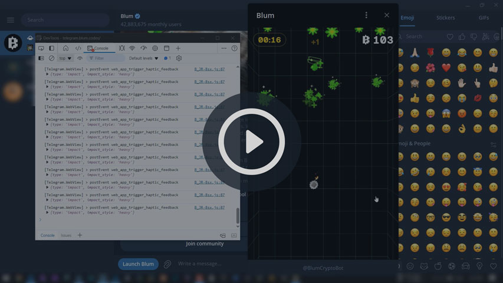

# 🤖 Blum Auto Clicker

A Free Blum Auto Clicker Bot Built With JavaScript

## How to Use

- Open Telegram Desktop.
- Navigate to `Settings > Advanced > Experimental Settings` and enable the option for `Enable webview inspecting`.
- Launch the Blum game, then right-click anywhere on the screen and select `Inspect`.
- In the Inspect window, switch to the `Console` tab.
- Copy the code from the `script.js` file found in this repository, paste it into the console, and press `Enter`.
- Start the game by clicking "Play" and enjoy the automation!

You can also watch the following video for more detailed instructions.

